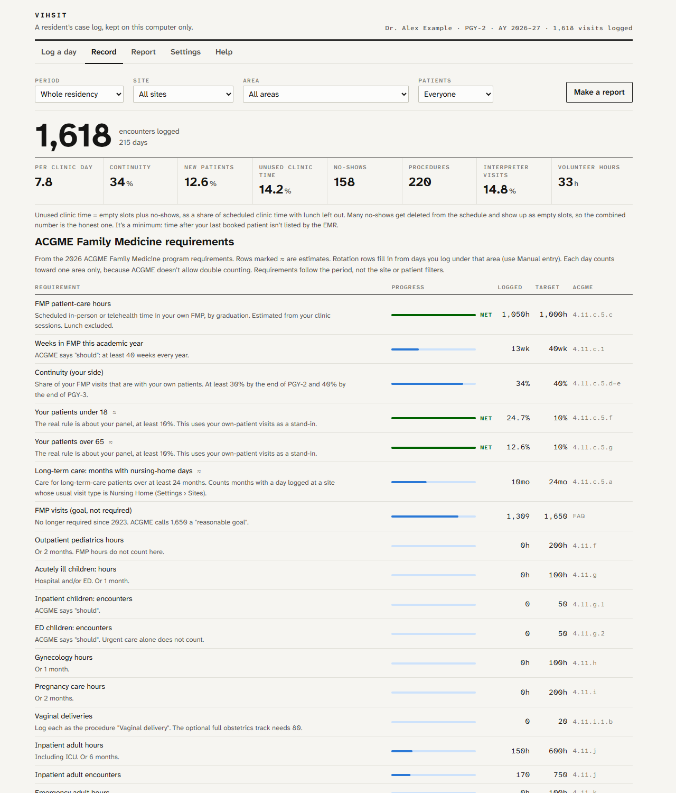
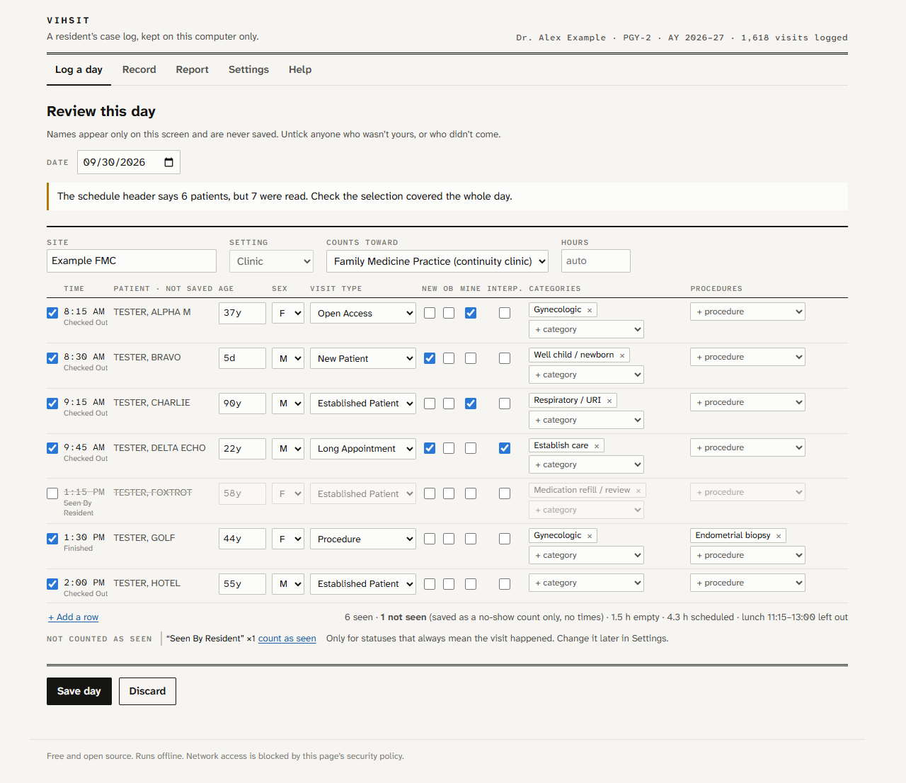
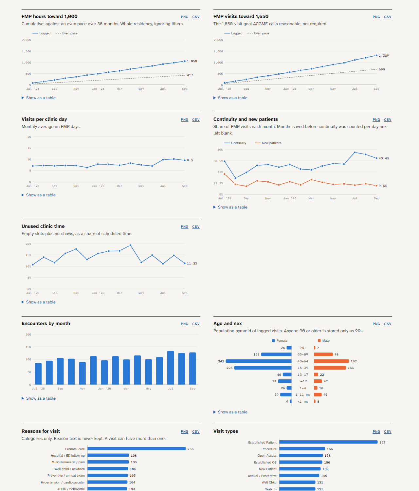
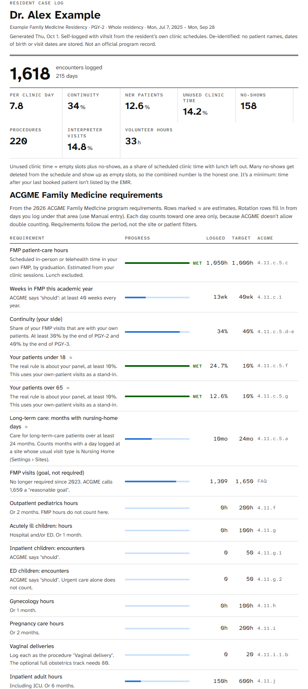
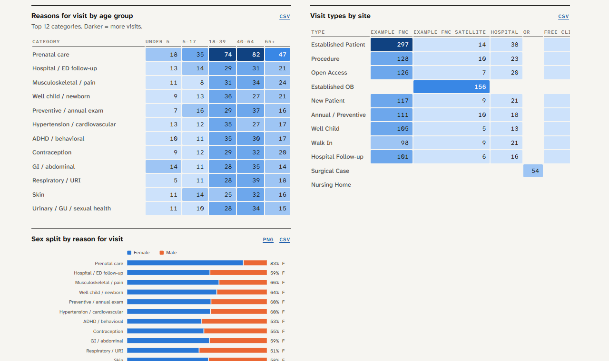

# vihsit

**A private case log for family medicine residents.** Paste a day's clinic schedule from the EMR and vihsit keeps a de-identified record of your residency: who you saw, what for, how your continuity is going, and where you stand on ACGME and program requirements. It runs entirely in your browser, works offline, and is blocked from using the network.

> **Built for Cerner (Oracle Health) and athenahealth.** Paste parsing is written and tested against their day-schedule views. Any other EMR works through a simple JSON day file, and sites with no EMR access (nursing homes, away rotations) work through manual entry. See [Supported schedules](#supported-schedules).

[](https://github.com/robbie-med/vihsit/actions/workflows/ci.yml)
[](LICENSE)
-informational)


**[Download vihsit.html](https://github.com/robbie-med/vihsit/raw/main/dist/vihsit.html)** · **[Open the hosted copy](https://robbie-med.github.io/vihsit/)** · [How privacy works](#how-privacy-works) · [Contributing](CONTRIBUTING.md)

---

## 🛑 Compliance officers, privacy officers, IT: read this before you say no

**Yes, a resident pastes their schedule into this. No, it is not a problem.** Here's what you're actually looking at:

- **There is no server.** vihsit is one HTML file that runs in the resident's browser. There's no account, no backend, no database anywhere but the resident's own machine. There's nothing for us to breach, because we never receive anything.
- **It can't send anything.** The page's own Content Security Policy is `default-src 'none'; connect-src 'none'`. The browser refuses every network request the page could make, including a buggy one, a malicious one, or one added by a future edit. That's enforced by the browser, not promised by us.
- **It doesn't keep PHI.** Names are shown on one review screen and never written down. Reason-for-visit text is turned into a category, then thrown away. MRNs, dates of birth, phone numbers and notes are dropped as the schedule is read. Visits are stored **without dates**. What's left: "a 34-year-old woman, established patient, respiratory, PGY-2, this academic year." Ages 90 and up are stored as `90+`, following Safe Harbor.
- **The schedule never touches the page.** Pasted text is read from the clipboard event in memory. It never lands in a text field, so the browser can't autosave or restore it, and the clipboard is wiped right after.
- **It's auditable in an afternoon.** It has no dependencies and no build magic. Everything that can write to storage goes through one allowlist function, [`sanitize()`](src/core.js), and the tests check that names and dates can't get through it.

**Check it yourself in five minutes.** Open `vihsit.html` with your browser's developer tools on the Network tab and use it: the tab stays empty. Then export a backup and read the JSON. It contains no names, no reasons for visit and no visit dates, only counts and categories.

The real risks sit outside the app, and the app tells residents about them on first run: OS clipboard sync, clipboard managers, browser extensions, and emailing schedules to yourself. If your institution has a personal-device policy, that policy still applies, and we tell residents so.

**So: it's a fancy tally counter. Please unpucker.** Questions or a real concern? See [SECURITY.md](SECURITY.md). We'd genuinely like to hear it.

---



*Screenshots use invented residents and synthetic data. Yes, the spelling is intentional.*

---

## Why

Most programs track resident experience loosely: a spreadsheet at the end of the year, or nothing. Residents rarely get their own numbers until it's too late to fix a gap. vihsit makes the log a side effect of something you already do, glancing at the day's schedule, and keeps it to yourself.

## Features

- **Paste and go.** Copy the day from Cerner (Oracle Health) or athenahealth and paste it anywhere on the page. The schedule never lands in a text box, the clipboard is cleared, and a review screen shows what will be saved.
- **De-identified by design.** Names exist only on the review screen. Reasons for visit become categories, and the text is discarded. Visits are saved without dates. See [How privacy works](#how-privacy-works).
- **ACGME requirements.** Progress against the 2026 ACGME Family Medicine requirements: FMP hours and weeks, continuity, panel mix, long-term care, the rotation hours and encounter minimums, and deliveries. Each row cites its requirement ID.
- **Your program's requirements.** A second set of targets built from filters: age range, category, visit type, procedure, own patients, area, per year.
- **Charts and breakdowns.** Pace toward graduation targets, monthly trends, an age and sex pyramid, reasons for visit, visit types, sites, reasons by age group, an empty-clinic-time heatmap, a procedure log, and hours by area. Filter by period, site, area or own patients. Export any chart as PNG or CSV.
- **Reports.** A one-click CCC summary, or pick your own sections. Print it or save it as a PDF for semi-annual reviews.
- **Every site, not just clinic.** Manual entry covers nursing homes, away rotations, deliveries and inpatient days. A site you log often gets a one-click "Log a day at …" button.
- **Corrections.** Paste a day again to add missed visits or remove wrong ones. Undo works until you close the tab.
- **Backups.** One-click export and restore. Backups hold only de-identified data.

| Review a pasted day | Charts |
|---|---|
|  |  |
| **CCC summary report** | **Breakdowns** |
|  |  |

## Quick start

1. **Get it.** [Download `vihsit.html`](https://github.com/robbie-med/vihsit/raw/main/dist/vihsit.html) and open it in Chrome, Edge or Firefox. Or use the [hosted copy](https://robbie-med.github.io/vihsit/). The downloaded file is the better choice: nobody has to trust a server, and it works without internet.
2. **Set up.** Work through the first-run privacy checklist, and enter your name, program and the year you started residency.
3. **Paste a day.** In the EMR, select the whole day's schedule, copy it, and press <kbd>Ctrl</kbd>+<kbd>V</kbd> (<kbd>⌘</kbd>+<kbd>V</kbd> on a Mac) on "Log a day". Untick anyone who wasn't yours, tick "Mine" for your continuity patients, and save.
4. **Back up.** Settings › Export backup, now and then. Browsers can clear site data, and Safari does so after 7 days without a visit.

## How privacy works

vihsit is built so that **nothing it stores is protected health information**, and so that **nothing can leave your computer**.

| | Stored |
|---|---|
| **Each visit** | Age in whole years (anyone 90 or older is stored as `90+`, and children under 2 also get months), sex, visit type, reason categories, procedures, site, area, academic year, PGY, and flags for new patient, OB, interpreter and own patient. **No date.** |
| **Each day** | Date, site, area, hours, and counts of visits, new patients, OB visits, own patients and no-shows, plus empty slot times. **No individual patients.** |
| **Never stored** | Names, reason-for-visit text, MRNs, dates of birth, phone numbers, notes, no-show times, or anything that links a visit to its day. |

- **One gate.** Every input path (Cerner, athena, manual entry, JSON import, backup restore) goes through a single allowlist function, `sanitize()` in [`src/core.js`](src/core.js), before anything is written. Anything not on the list is dropped, whatever a parser or import sends. It's the one function to review.
- **No network.** The page's Content Security Policy is `default-src 'none'; connect-src 'none'`, with scripts and styles allowed only by hash. There are no web fonts, CDNs, analytics or update checks. Open your browser's developer tools and the Network tab stays empty.
- **No raw text in the page.** Pasted text is read from the clipboard event and parsed in memory. It never enters the DOM, and the clipboard is cleared afterward.

### Before you use it with real schedules

A web page can't check these, so the app asks you to confirm them on first run:

- **Windows:** Settings › System › Clipboard. Turn off "Clipboard history" and "Sync across your devices".
- **Mac:** System Settings › General › AirDrop & Handoff. Turn off Handoff, which also turns off Universal Clipboard.
- **Clipboard managers** (Ditto, Maccy, Raycast, Alfred, Paste): pause them, or exclude your browser.
- **Browser:** use a profile with no extensions, because extensions can read what's on the page.
- **Copying:** copy straight from the EMR on the same computer. Never email or text a schedule to yourself.

> **This is not legal advice.** Your hospital's policies apply to you regardless of what this tool does. Show this page to your GME office or privacy officer before you start. The hosted copy is served from `robbie-med.github.io`, so browser storage there is shared with any other pages on that origin. Use the downloaded file if that matters to you.

## Supported schedules

| Source | How |
|---|---|
| **Cerner / Oracle Health** | Clinic and surgery day schedules, including over-selected page text, satellite sites, OB clinics and procedure clinics. |
| **athenahealth** | Whole-clinic day lists (for example, free clinics). You tick your own patients and pick the day from the week shown. |
| **Any other EMR** | A small JSON "day file" that a script or a **local** AI model can produce. The format and a ready-made prompt are under Help in the app. Never send a real schedule to a cloud AI. |
| **No EMR access** | Manual entry for nursing homes, away rotations, deliveries and inpatient days, with a count-only option for busy days. |

Labels the app doesn't recognize can be taught from the review screen. For example, "always use this" for a visit type, or "count as seen" for a status.

## ACGME requirements

vihsit tracks the quantitative requirements in the **2026 ACGME Program Requirements for Family Medicine** (section 4.11) and the Family Medicine FAQ: 1,000 FMP hours, at least 40 FMP weeks a year, continuity of 30% by the end of PGY-2 and 40% by the end of PGY-3, a panel at least 10% under 18 and at least 10% over 65, long-term care over 24 months, 20 vaginal deliveries, and the hour and encounter minimums for pediatrics, gynecology, pregnancy care, inpatient adult medicine, emergency medicine and older adults.

Some rows are marked ≈. Panel percentages and long-term care are estimated from your logs. Each logged day counts toward one area only, because ACGME doesn't allow double counting. Targets are editable for different tracks, such as 80 deliveries on the full obstetrics track. vihsit is a personal log, not an official program record, and isn't affiliated with ACGME.

## Development

No dependencies. Node 18 or newer.

```sh
npm test          # or: node --test   (parsers, privacy gate, stats)
npm run build     # or: node build.mjs (writes dist/vihsit.html)
```

```
src/core.js         parsers, categorizer, privacy gate (sanitize), stats. No DOM, so it's tested in Node
src/app.js          UI and IndexedDB
src/style.css       styles; fonts are inlined at build time
src/index.html      page shell
build.mjs           inlines everything into one file and writes the CSP hashes
test/               node:test suite; fixtures use invented patients only
tools/              one-off migration from an older local logger
dist/vihsit.html    the built app, committed so it can be downloaded directly
```

To add an EMR, write a parser in `src/core.js` that returns the same `ParsedPaste` shape as `parseCerner` and `parseAthena`, and add a fixture with invented patients to `test/fixtures.js`. The privacy gate needs no changes. See [CONTRIBUTING.md](CONTRIBUTING.md).

## Contributing and security

Contributions are welcome. Please read [CONTRIBUTING.md](CONTRIBUTING.md) first, especially the rule that **real patient data never goes into an issue, pull request or fixture**. To report a privacy or security problem, see [SECURITY.md](SECURITY.md).

## License

[MIT](LICENSE). Fonts: [Atkinson Hyperlegible Next and Mono](https://www.brailleinstitute.org/freefont/) by the Braille Institute, under the SIL Open Font License (see [`fonts/`](fonts)).
